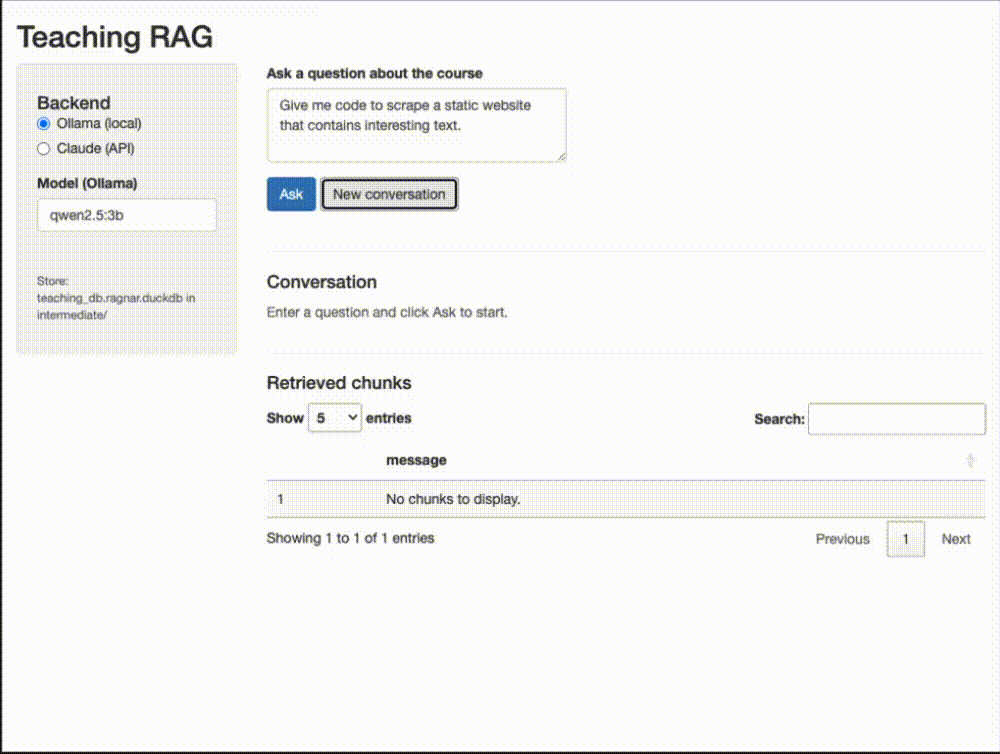
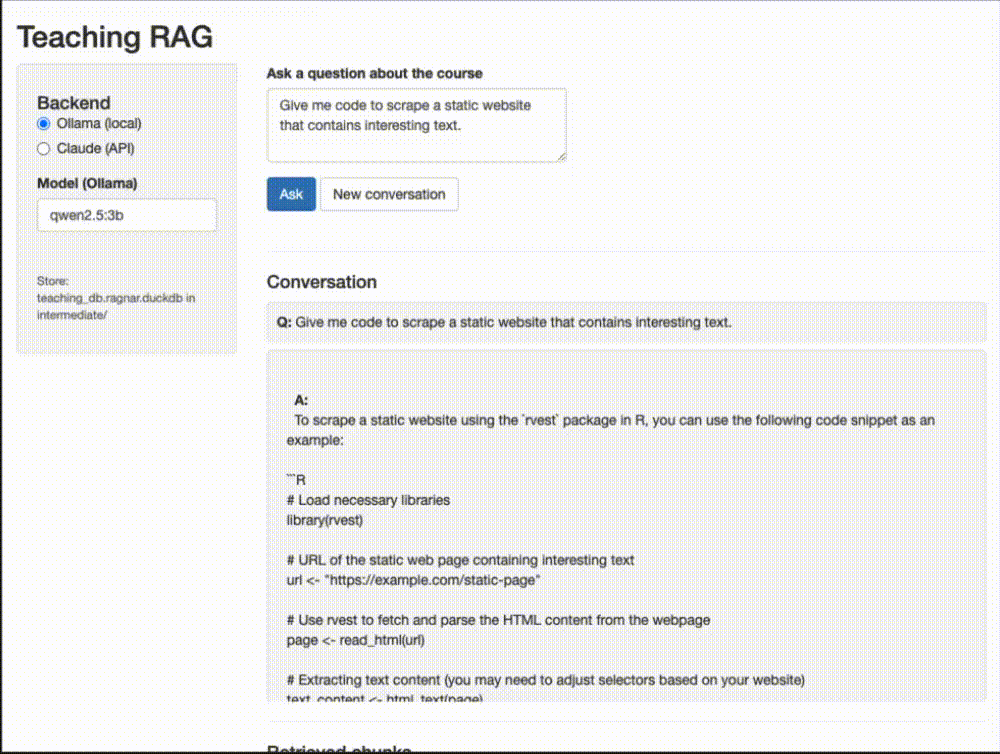
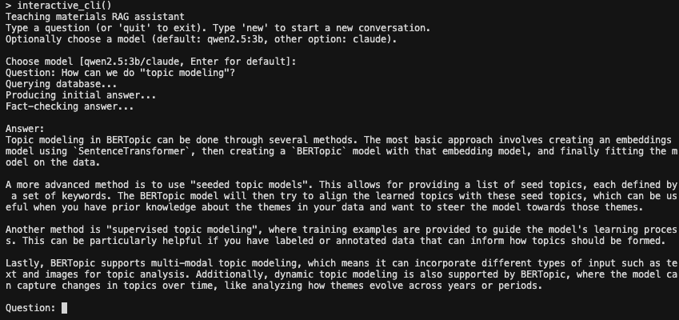

## Description and motivation

Teaching Computational Social Science means juggling a lot of moving parts: weekly slides, code-heavy handouts, assignment descriptions, and project guidelines. Students often have very specific questions ("Where did we talk about supervised vs. unsupervised learning?" or "What exactly did you say about OCR vs. Whisper?") that are answered somewhere in the materials, but not always easy to find on short notice. Rather than sending them back to a generic chatbot, I built a **Retrieval-Augmented Generation (RAG)** system that knows only about *my* course and answers questions based strictly on the resources I gave them.

I packaged this into an R package called **teachrag**, available on [GitHub](https://github.com/fellennert/teachrag). It uses the `ragnar` package to turn course materials into a searchable store, connects to Ollama (local) or Claude (API) for answers, and includes a Shiny app and setup wizard for interactive use.

## Data source

The underlying corpus consists of teaching materials for a semester-long Computational Social Science course that was taught at Leipzig University in the fall of 2025:

- The **syllabus** (syllabus/, with reading lists and policies) -- this is used to ensure that the answers are within the scope of the course
- **Lecture slides** (slides/, PDFs for intro, web scraping, optical character recognition, audio transcription and diarization, and different approaches to using text as data) -- these are chunked by slide-sized chunks
- **Topic-specific notebooks** (script/, Quarto files such as `14_supervised_ml.qmd`, `17_BERT.qmd`, `18_GPT.qmd`) and other documents (e.g., `syllabus.qmd`, `lecture_notes.qmd`) -- these are chunked by section-sized chunks

The R package ships with all underlying course materials pre-built. If you want to read through the materials yourself, I have published them on a dedicated [course website](https://fellennert.github.io/toolbox_css/). Instructors who want to use their own materials can do so via `parse_materials()`, `build_store()`, or the setup wizard (this functionality is still experimental).

## The teachrag package

For students, the package provides four ways to ask questions about the course materials (all use bundled data by default):

- **Single-turn** (`ask_rag()`) — ask one question and get an answer
- **Multi-turn chat** (`ask_rag_chat()`) — ask follow-up questions with fresh retrieval for each turn
- **Shiny app** (`run_app()`) — interactive Q&A with conversation history and retrieved chunks
- **CLI** (`interactive_cli()`) — terminal-based prompt

For instructors who want to parse and index their own materials, the package also includes `parse_materials()`, `build_store()`, and a `run_setup_wizard()` that guides through first-time setup. 

### Installation and dependencies

The package ships with pre-built course data, so you can run Q&A immediately without any setup. Install from GitHub and verify dependencies:

```{r}
#| label: install
#| eval: false

# Install from GitHub
remotes::install_github("fellennert/teachrag")

# Check dependencies (R packages, Ollama models)
# Run ensure_dependencies() to install any missing R packages
teachrag::check_dependencies()
teachrag::ensure_dependencies()
```

Before first use, ensure you have [Ollama](https://ollama.com/) installed with `qwen2.5:3b` and `nomic-embed-text` pulled, or `ANTHROPIC_API_KEY` set if you prefer Claude (in the latter case you will still need Ollama and `nomic-embed-text` for the embeddings; you can also use the Shiny app to set up the API key).

### Asking questions

Once installed, you can query the course materials in several ways. All of these show progress: **Querying database…** → **Producing initial answer…** → **Fact-checking answer…**

**Single-turn Q&A** — ask one question and get an answer:

```{r}
#| label: single-turn

library(teachrag)
ask_rag("What is supervised machine learning?")
```

**Multi-turn chat** — ask follow-up questions and keep context. Note that the chat state is stored in the `chat_state` object and passed to the function to keep track of the conversation history. Furthermore, I set the temperature of the LLM to 0.1, meaning that the model will be more creative and less deterministic in its answers -- i.e., the same question will likely yield a slightly different answer each time. Document retrival is deterministic, meaning that the same question will always be anwered "based" on the same information.

```{r}
#| label: multi-turn

chat_state <- NULL
res1 <- ask_rag_chat(chat_state, "What is supervised machine learning?")
chat_state <- res1$chat_state
cat(res1$answer)

res2 <- ask_rag_chat(chat_state, "How is it useful for social science research?")
chat_state <- res2$chat_state
cat(res2$answer)
```

**Shiny app** — this provides an interactive Q&A with conversation history and retrieved chunks, plus a sidebar to choose Ollama (local) or Claude (API key):

```{r}
#| label: shiny
#| eval: false

run_app()
```

You can ask a brief question and get an answer:


…or ask a follow-up question and get an answer that also takes into account the previous question.


As you can see, the text generation takes a while on my 2021 MacBook Pro -- this is why I added a progress bar to the Shiny app. You might want to run this either on a more powerful machine or use Claude via API.

**CLI** — interactive prompt in the terminal:

```{r}
#| label: cli
#| eval: false

interactive_cli()
```



As you can see, the CLI is a bit more limited in its functionality. You can ask a question and get an answer, but you cannot ask follow-up questions.

### Architecture

My goal was to create a system that is:

- easy to use for students and instructors
- easy to extend to other courses and materials
- easy to maintain and update
- easy to deploy and scale
- not prone to hallucinations and other LLM-related issues

To achieve this, I implemented the following steps:

1. **Parse**: Discover files (qmd, Rmd, md, pdf), convert to markdown via `ragnar::read_as_markdown`, chunk by doc type (slides by `" --- "`, breaking them up into slide-sized chunks, scripts by `"##"` and `"###"`, breaking them up into section-sized chunks), and then write `syllabus.rds` and `chunks.rds` to the output directory. `syllabus.rds` is later fed into the LLM to ensure that question and answer are within the scope of the course -- I did not want to make this a general chatbot.

2. **Build store**: Read chunks, reformat for ragnar, create DuckDB store with `nomic-embed-text` embeddings via Ollama.

3. **Query**: `ask_rag()` retrieves relevant chunks with BM25, formats context, sends to the LLM; a content checker (based on either Claude or a local model) ensures questions and answers are within scope using the syllabus summary.

4. **Multi-turn**: `ask_rag_chat()` keeps the same chat session and retrieves fresh chunks for each follow-up question so answers stay aligned with course content.

## Requirements

- **R packages**: `dplyr` (>= 1.2.0) and others (see DESCRIPTION). Run `teachrag::check_dependencies()` to verify, or `teachrag::ensure_dependencies()` to install missing packages.
- **[Ollama](https://ollama.com/)** with models `qwen2.5:3b` and `nomic-embed-text` (for local Q&A and embeddings).
- **Claude API** (optional): if you prefer Claude via API, set `ANTHROPIC_API_KEY` in your environment. You will still need Ollama and `nomic-embed-text` for the embeddings.

## Summary

This project turns a semester's worth of teaching materials into a focused RAG system. The `teachrag` package ships with pre-built course data, so students can install it, check dependencies, and start asking questions immediately — via single-turn Q&A, multi-turn chat, a Shiny app, or the CLI. Answers are grounded in the course materials and fact-checked against the syllabus. The system is intentionally modest: it does not try to be a general-purpose assistant, but rather a guided search and explanation tool over a well-defined corpus. The code is available as an R package on [GitHub](https://github.com/fellennert/teachrag).
