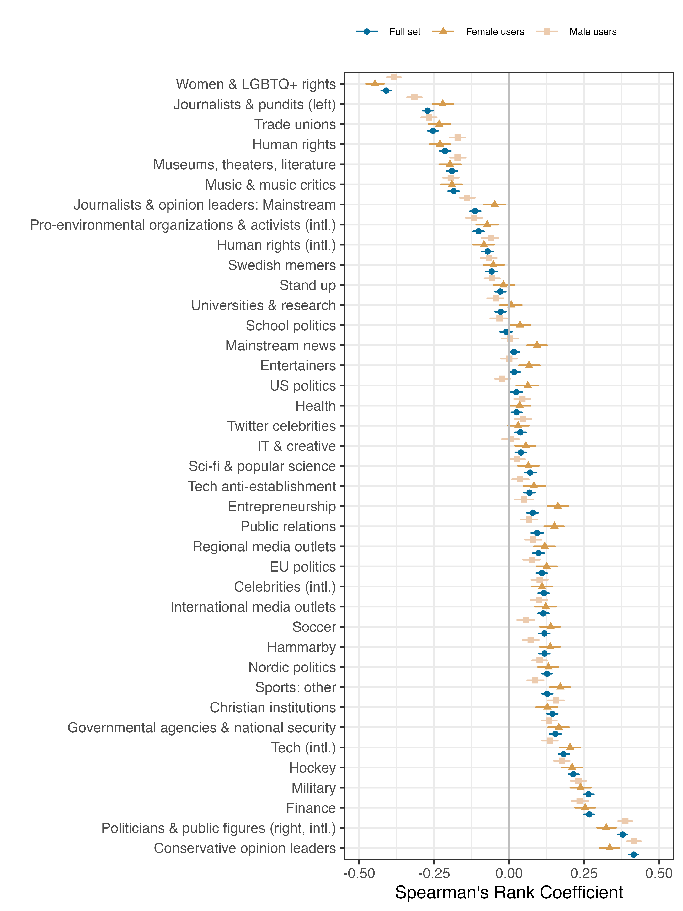

We're all familiar with the cultural divides in American politics: the Prius-driving liberal versus the pickup-driving conservative. But my co-authors and I wondered -- is this phenomenon unique to the American two-party system, or does it show up in countries with more diverse political landscapes? To find out, we turned to Sweden, a multi-party democracy where voters choose among eight parliamentary parties across the political spectrum. 

## Our Approach

I was in charge of the research design and data analysis. Thus, I started this project wondering: what data could we use to get both people's lifestyle interests (e.g., the music they like, the blogs they enjoy reading) but also what's their political leaning. I turned to Twitter, since users, on the one hand, are interested to follow their favorite politicians (which I can use to infer their political leaning) but also the stuff they're interested in in their day-to-day life. 

I collected data on 11,000 politically engaged Swedish Twitter users and analyzed their following patterns using **mixed membership clustering** -- a technique that allows people to belong to multiple communities simultaneously, capturing the messy reality of how we actually engage with content online. 

To have my models cut through the noise, I used a clustering approach where I could pre-specify particular clusters (such as political parties). The lifestyle interest cluster was pre-specified with interests I found by applying an inductive model. This yielded clusters such as "Soccer", "Women \& LGBTQ rights", "Entertainers", or "Museums" which I then formalized in the constrained, pre-specified model.

I fitted politics and lifestyle models separately. Thus, I got one distribution of "membership" of a user with a certain party (roughly, the share of politicians they follow from a given party), which we interpreted as their political leaning, and a distribution of how much interest they take in certain lifestyles.

Finally, I could go to work and correlate these two scores in various ways and also look at which interests co-occur together using Hierarchical clustering. I further used expert-survey data to incorporate left-right position of the parties and inferred the users' gender by looking at their profile and performing fuzzy-matching using existing dictionaries of gendered Swedish first names.

## What We Found

Political affiliation predicts *a lot* more than just policy preferences. Swedish voters' media consumption, cultural interests, religious views, and even their sense of humor cluster along partisan lines. Left-leaning users follow human rights organizations, environmental groups, museums, and progressive journalists. Right-leaning users follow different content entirely: finance accounts, sports, military/security topics, and conservative commentators -- even when those accounts have nothing explicitly political about them. This is also hardly affected by gender.

The most surprising finding? Even with eight parties to choose from, Swedish Twitter users sorted themselves into just **two broad camps** based on their everyday interests. These camps closely mirror the left-right coalition structure in Swedish politics. The strongest patterns appeared at the political extremes, while centrist parties showed weaker cultural alignment.

## Why It Matters

This suggests that lifestyle polarization isn't a quirk of the American two-party system. Even in a country with proportional representation and coalition governments, political identity has become intertwined with everyday cultural choices. We're not just disagreeing about taxes and healthcare -- we're living in separate cultural universes.

Our research reveals that brands operate in a politically polarized landscape whether they acknowledge it or not. Even ostensibly neutral product categories, like sports, finance, arts, entertainment, can carry implicit political associations that shape who engages with them. When brands target "environmentally conscious consumers" or "finance enthusiasts," they're not just targeting a hobby or interest; they're targeting a broader cultural-political identity that includes distinct media consumption patterns, values, and social networks. The study shows this isn't unique to America's two-party system but happens in multi-party democracies too, meaning international brands can't assume European or Scandinavian markets are immune to culture wars.

For marketers, this means traditional segmentation strategies are incomplete. Demographics and psychographics tell only part of the story. Instead, the cultural-political identity is a hidden dimension that determines whether your message resonates or repels. Influencer partnerships, product positioning, and even category choice now carry political weight. The "neutral middle" where brands can safely appeal to everyone is smaller than most marketers assume. Brands that ignore this reality risk either leaving money on the table by failing to connect with their natural audience, or accidentally alienating customers by sending mixed cultural signals. Understanding these cultural fault lines isn't about "getting political" -- it's about understanding the actual structure of your market.